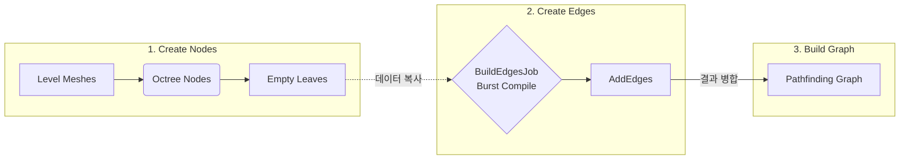
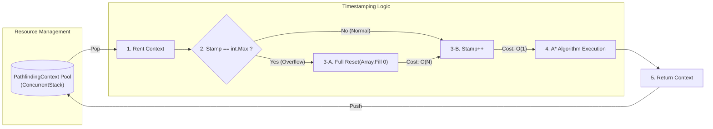
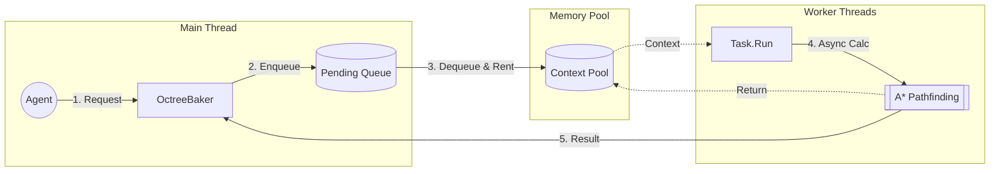

# Unity 3D Volumetric Pathfinding System (Octree & A*)

    

> **"3D 비행체 및 수중 유닛을 위한 3차원 공간 분할 및 경로 탐색 솔루션"**
>
> Unity의 NavMesh(2D Surface 기반) 한계를 넘어, **Octree**를 활용해 3차원 공간을 복셀화(Voxelization)하고, **C# Job System**과 **Threading** 및 **Zero-Allocation Pooling** 기법을 적용해 최적화한 자체 구현 프로젝트입니다.

---

## 목차
1. [프로젝트 개요 (Overview)](#프로젝트-개요-overview)
2. [핵심 기술 및 구현 (Key Implementation)](#핵심-기술-및-구현-key-implementation)
    - [1. Octree 공간 분할 및 그래프 생성](#1-octree-공간-분할-및-그래프-생성)
    - [2. C# Job System을 활용한 병렬 처리](#2-c-job-system을-활용한-병렬-처리-optimization)
    - [3. Zero-Allocation A* Pathfinding (메모리 최적화)](#3-zero-allocation-a-pathfinding-메모리-최적화)
    - [4. Async/Await 기반 멀티스레딩](#4-asyncawait-기반-멀티스레딩)
    - [5. String Pulling & Local Avoidance](#5-string-pulling--local-avoidance)
3. [기술적 도전 및 해결 (Troubleshooting & Optimization)](#기술적-도전-및-해결-troubleshooting--optimization)
4. [성과 및 성능 지표 (Performance)](#성과-및-성능-지표-performance)
5. [설치 및 사용법 (Installation)](#설치-및-사용법-installation)

---

## 프로젝트 개요 (Overview)
기존 Unity NavMesh는 바닥을 걷는 캐릭터에 최적화되어 있어, 공중을 나는 드론이나 우주선 같은 오브젝트의 길찾기에는 적합하지 않습니다. 본 프로젝트는 이를 해결하기 위해 **빈 공간**을 노드로 연결하여 그래프를 구축하고, 3차원 A* 알고리즘을 수행합니다.

### 주요 목표
* **Full 3D Navigation:** x, y, z 축을 모두 활용한 자유로운 경로 탐색.
* **High Performance:** 실시간 게임플레이를 저해하지 않는 고성능 연산.
* **GC Spike 방지:** 런타임 메모리 할당을 최소화하여 프레임 드랍 방지.

---

## Demo

<p align="center">
  <a href="https://www.youtube.com/watch?v=J1d0SdvNlTk">
    
  </a>
  <br>
  <em>Click to Watch Demo Video</em>
</p>

---

## 핵심 기술 및 구현 (Key Implementation)

### 1. Octree 공간 분할 및 그래프 생성
맵 전체를 감싸는 Bounding Box에서 시작하여, 장애물(Mesh)과 충돌하는 노드를 재귀적으로 8등분합니다.
<p align="center">
  
  <br>
  <em>Loose Octree 시각화: 장애물 주변은 세밀하게(Dense), 빈 공간은 크게(Sparse) 분할됨</em>
</p>

* **Loose Octree 접근:** `MeshFilter`의 버텍스를 월드 좌표로 변환해 정확한 AABB(Axis-Aligned Bounding Box)를 계산합니다.
* **재귀적 분할:** 설정된 `minNodeSize`에 도달하거나, 내부에 장애물이 없을 때까지 분할을 반복합니다.
* **빈 공간 추출:** `Empty Leaves`를 추출하여 이동 가능한 노드로 간주하고 그래프를 생성합니다.


> *Octree 생성과 Pathfinding Graph 생성 흐름*

### 2. C# Job System을 활용한 병렬 처리 (Optimization)
초기 구현 시 $O(N^2)$의 복잡도를 가지는 "노드 간 인접성 검사(Edge Building)" 로직이 메인 스레드에서 병목을 일으켰습니다. 이를 **Unity Job System** 및 **Burst Compile**을 도입하여 해결했습니다.

```csharp
// Octree.cs (Partial)
[BurstCompile]
public struct BuildEdgesJob : IJobParallelFor
{
    [ReadOnly] public NativeArray<AABB> boundsArray;
    public NativeList<int2>.ParallelWriter edgeWriter;

    public void Execute(int index)
    {
        // 병렬 처리로 각 노드의 인접 여부를 고속 연산
        var a = boundsArray[index];
        for (int j = index + 1; j < boundsArray.Length; j++)
        {
            if (a.Intersects(boundsArray[j]))
            {
                edgeWriter.AddNoResize(new int2(index, j));
            }
        }
    }
}
```

### 3. Zero-Allocation A* Pathfinding (메모리 최적화)
A* 알고리즘은 잦은 호출로 인해 `List`, `Dictionary`, `HashSet` 등의 가비지 생성(GC Allocation)이 많습니다. 이를 해결하기 위해 **Context Pooling**과 **Timestamping** 기법을 적용했습니다.

* **Context Pooling:** 경로 탐색에 필요한 배열(`f`, `g`, `h`, `closed` 등)을 미리 할당해두고 재사용합니다.
* **Lazy Clear (Timestamping):** 배열을 매번 `Array.Clear()`로 초기화하는 비용 $O(N^2)$을 없애기 위해, `stamp` 정수값을 비교하여 유효성을 검증합니다.

```csharp
// PathfindingContext.cs
public void Activate(int id)
{
    // 배열 초기화 없이 스탬프만 갱신하여 O(1) 초기화 효과
    stamp[id] = currentStamp; 
    f[id] = float.MaxValue;
    // ...
}

public bool IsActive(int id) => stamp[id] == currentStamp;
```


> *PathfindingContext의 Stamp업데이트를 통한 Lazy-Clear 흐름*

### 4. Async/Await 기반 멀티스레딩
경로 탐색 요청이 메인 스레드를 차단(Block)하지 않도록 `Task`와 `ConcurrentQueue`를 활용한 비동기 시스템을 구축했습니다.

* **Throttling:** `maxConcurrentTasks`를 두어 동시에 실행되는 탐색 작업 수를 제한, CPU 점유율을 관리합니다.
* **Thread-Safety:** `ConcurrentStack`을 사용한 풀링과 `ConcurrentQueue`를 활용해 스레드 안전한 경로 요청 반환 시스템을 구현했습니다.

```csharp
// OctreeBaker.cs

//멀티스레드 환경에서 동시다발적인 Enqueue(), Dequeue()에 대응하기 위함 
private readonly ConcurrentQueue<(OctreeAgent agent, List<Node> path, bool result)> completeAgents = new();

Task task = Task.Run(() =>
{
    PathfindingContext ctx = pool.Rent(); // 풀에서 컨텍스트 대여, 내부적으로 ConcurrentStack을 사용중.
    try
    {
        // 별도 스레드에서 무거운 A* 연산 수행
        bool result = graph.AStar(start, end, ref path, ctx);
        completeAgents.Enqueue((req.agent, path, result));
    }
    finally { pool.Return(ctx); } // 반납
});
```


> *Agent들의 동시다발적인 Path요청과 그에 따른 OctreeBaker의 비동기 요청 처리 흐름*

### 5. String Pulling & Local Avoidance
* **Path Optimization:** 격자(Grid) 단위의 이동으로 인한 부자연스러운 "지그재그" 움직임을 `Physics.Raycast`를 이용한 **String Pulling** 기법으로 직선화했습니다. (`PathOptimizer.cs`)
<table>
  <tr>
    <td align="center">
      
      <br>
      <b>Before: Raw Path (ZigZag)</b>
    </td>
    <td align="center">
      
      <br>
      <b>After: String Pulling (Straight)</b>
    </td>
  </tr>
</table>

* **Local Avoidance:** 경로를 따라가되, 갑작스러운 장애물을 피하기 위해 Raycast 센서를 이용한 **Weighted Steering**을 적용하여 유동적인 움직임을 구현했습니다. (`OctreeAgent.cs`)

---

## 기술적 도전 및 해결 (Troubleshooting & Optimization)

### 1. 그래프 빌드 병목 해결: Spatial Hashing vs Job System
* **Problem:** 13,000개 이상의 노드를 생성할 때, 노드 간 인접성 전수 조사 $O(N^2)$으로 인해 베이킹 시간이 10초 이상 소요되는 병목이 발생했습니다.
* **Decision:** 탐색 범위를 좁히기 위해 `Spatial Hashing` 도입을 검토 및 시행했으나, 이미 공간 분할이 완료된 Octree 구조 위에서 추가적인 해시 테이블을 유지하는 것은 메모리 오버헤드와 연산 중복이라 판단했습니다. 실제로 테스트 결과 성능 향상이 미미하여 해당 방식은 폐기(Obsolete)했습니다.
* **Solution:** 알고리즘의 복잡도를 낮추는 대신 `Unity Job System` 및 `Burst Compile`을 도입하여 연산을 병렬화했습니다. 데이터 레이아웃을 선형적으로 재구조화하여 CPU 캐시 효율을 높이고 멀티 코어를 활용함으로써 성능을 극대화했습니다.

### 2. 비동기 멀티스레딩 기반 경로 탐색 시스템
* **Problem:** 다수의 에이전트가 동시에 경로를 요청할 경우, 메인 스레드의 연산 부하가 급증하여 프레임 드랍(Stuttering) 현상이 발생했습니다.
* **Decision:** 코루틴(Coroutines)을 이용한 시분할 처리는 여전히 메인 스레드 자원을 소모하므로 한계가 있다고 판단했습니다. 따라서, 복잡한 동기화 문제가 있더라도 연산 로직을 메인 루프와 완전히 분리된 워커 스레드로 이관하기로 결정했습니다.
* **Solution:** `System.Threading.Tasks`와 `ConcurrentQueue`를 활용하여 비동기 경로 탐색 파이프라인을 구축했습니다.
  * **Throttling:** `maxConcurrentTasks` 설정을 통해 과도한 스레드 생성을 막고 CPU 점유율을 관리합니다.
  * **Thread-Safety:** 스레드 안전한 큐를 통해 계산 완료된 경로 데이터를 메인 스레드로 안전하게 전달하여 반영합니다.

### 3. 실시간 연산 중 GC 억제 (Zero-Allocation)
* **Problem:** A* 알고리즘 특성상 탐색할 때마다 `List`, `Dictionary` 등 다수의 객체를 생성(`new`)해야 하며, 배열 재사용을 위한 초기화(`Array.Clear`) 또한 노드 수($N$)에 비례하는 비용이 발생하여 GC Spike를 유발했습니다.
* **Decision:** 편의성을 제공하는 표준 컬렉션 사용을 포기하고, 메모리 사용량을 조금 희생하더라도 미리 최대 크기의 배열을 할당해두고 재사용하는 **Object Pooling** 패턴이 필수적이라 판단했습니다.
* **Solution:** `PathfindingContextPool`을 구축하여 탐색에 필요한 모든 배열 데이터를 미리 할당된 객체(`PathfindingContext`)로 관리하여 런타임 할당을 **0B**로 줄였습니다.
  * **Timestamping:** 배열을 매번 0으로 초기화하는 대신, 각 노드에 `currentStamp`를 부여했습니다. 현재 탐색 회차와 노드의 스탬프를 대조하는 방식(Lazy Clear)을 통해 초기화 비용을 $O(1)$으로 최적화했습니다.

---

## 성과 및 성능 지표 (Performance)

| 최적화 항목 | 적용 전 (Before) | 적용 후 (After) | 개선 결과 |
|:---:|:---:|:---:|:---|
| **그래프 생성 (Build)** | 11.753초 | **1.117초** | **약 10.5배 단축** |
| **메모리 할당 (GC)** | ~24KB / Request | **0KB (Zero Alloc)** | GC 프레임 드랍 제거 |
| **평균 프레임 (FPS)** | 75~90 fps | **120~145 fps** | 연산 효율 증가 |

* ### Graph Build
| **Mainthread-Only** | **Job & Burst** |
| :---: | :---: |
|  |  |
| *Mainthread-Only Graph Build: 11.75s* | *Job & Burst based Graph Build: 1.12s* |
> *테스트 환경 : 150개 Level Objects, Node 13,867개 기준*

* ### Path Request & A*
| **Mainthread-Only** | **Concurrent & PathContextPool** |
| :---: | :---: |
|  |  |
| *Mainthread-Only: 89 FPS* | *Concurrent & PathContextPool: 132 FPS* |
> *테스트 환경 : 100개 OctreeAgents, Node 13,867개 기준*
> 
> *참고 : Concurrent & PathContextPool 환경에서는 Local-Avoidance와 Path Optimizer도 연산 중.*

---

## 설치 및 사용법 (Installation)

1. **설정 (Setup)**
   - Level의 부모 오브젝트를 `OctreeBaker` 컴포넌트의 `levelParent`에 등록합니다.
   - `Min Node Size`를 설정합니다 (작을수록 정교하지만 연산량 증가).
   - 유니티 실행 시 `Awake`에서 자동으로 Octree 데이터가 생성됩니다.

2. **에이전트 (Agent)**
   - 이동할 오브젝트에 `OctreeAgent` 및 `Rigidbody`를 추가합니다 (useGravity는 false로 설정해주세요).
   - 장애물 레이어(`Obstacle Mask`)를 설정한 후 이동할 목적지를 지정합니다.

---

### Contact
* **GitHub:** [https://github.com/iruril](https://github.com/iruril)
* **Email:** [gksxodnr99@gmail.com](mailto:gksxodnr99@gmail.com)

---
*Developed with Unity 6000.0.62f1 LTS.*
